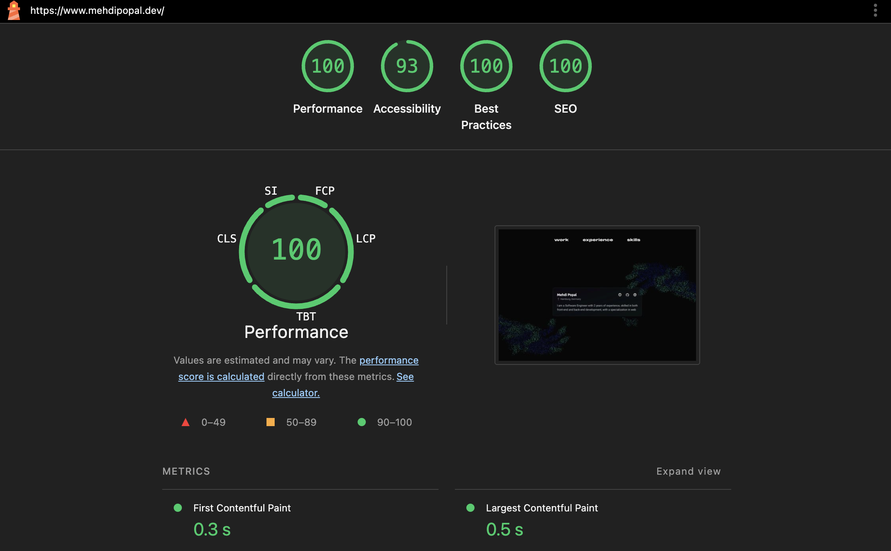

# 🚀 Portfolio Evolved

**[View Live →](https://www.mehdipopal.dev)**

An interactive developer portfolio that blends 3D graphics with functional web design. Built with Next.js 15, TypeScript, and React Three Fiber.



---

## ✨ Highlights

This isn't a typical portfolio site. Every project page is interactive:

- **Play actual games** – Two Unity games (Way of the Warrior and Time Travel Sync) are fully playable right in the browser
- **Shoot to reveal skills** – A first-person shooter-style 3D game where you target butterflies flying through space to discover my tech stack
- **Inspect 3D models** – Interactive cart with camera controls to view from any angle
- **Animated logo** – Custom particle system using shaders that morphs into the logo on page load
- **Particle effects** – Hover over navigation links to trigger particle explosions that form button outlines

---

## 🏔️ The Journey

This started as an experiment: how much interactivity and interesting 3D elements can you pack into a portfolio without destroying the performance & user experience?

The first version was heavy on visuals and experimental elements but light on structure. I rebuilt it from scratch using the [react-three-next](https://github.com/pmndrs/react-three-next) starter, improving features, adding proper code splitting, accessibility considerations, and a single-canvas architecture. The single-canvas approach might be overkill for this use case, but I wanted to learn the pattern for managing multiple 3D scenes efficiently.

What you're seeing now reflects what I learned about balancing creativity with maintainability UX and performance.

---

## 🛠️ Tech Stack

| Category      | Technologies                        |
| ------------- | ----------------------------------- |
| Framework     | Next.js 15 (App Router), TypeScript |
| Styling       | Tailwind CSS                        |
| 3D            | React Three Fiber, Drei, Three.js   |
| Animation     | GSAP, Custom GLSL Shaders           |
| Smooth Scroll | Lenis                               |
| Deployment    | Vercel                              |

---

## 🎯 Key Features

### Interactive Elements

- **FPS Skills Game**: Camera follows a curved tube path while you shoot 3D butterflies to collect skills
- **Embedded Games**: itch.io iframes let you play my Unity games directly on the site
- **3D Model Viewer**: Cyberpunk cart with Leva controls for preset camera angles
- **Custom Particle System**: GLSL shaders animate thousands of particles into logo shapes
- **Responsive 3D**: Different 3D configurations for mobile vs desktop

### Technical Approach

- **Single Canvas Architecture**: Uses `gl.scissor` to render multiple viewports from one WebGL context
- **Dynamic Imports**: Heavy 3D components load on-demand to keep initial bundle small
- **Model Preloading**: GLTF files are preloaded to avoid pop-in
- **Persistent Canvas**: Canvas stays mounted across route changes to preserve WebGL state
- **Model Optimization**: The 3D Models are heavily optimized

---

## 📁 Project Structure

```
src/
├── app/                     # Next.js routes & pages
│   ├── cart/                # 3D cart showcase
│   ├── wotw/                # Way of the Warrior game
│   ├── ttsync/              # Time Travel Sync game
│   └── legacylines/         # Legacy Lines project
├── components/
│   ├── canvas/              # 3D components
│   │   ├── SkillsGame.tsx  # FPS butterfly shooter
│   │   ├── LogoAnimated.tsx # Particle logo animation
│   │   └── Models.tsx       # All 3D models
│   ├── dom/                 # Regular React components
│   └── ui/                  # Shadcn/ui components
├── templates/
│   └── Shader/              # Custom GLSL shaders
└── public/                  # 3D models and images
```

---

## Getting Started

```bash
git clone https://github.com/mehdi-000/portfolio-evolved.git
cd portfolio-evolved
yarn install
yarn dev
```

Build for production:

```bash
yarn build
yarn start
```

---

## 📊 Performance Metrics

- ✅ **First Contentful Paint**: < 1.5s
- ✅ **Time to Interactive**: < 3.0s
- ✅ **Lighthouse Score**: 90+ across all categories
- ✅ **Zero layout shifts** (CLS: 0)

_See `docs/` for detailed performance reports_

---

## 🔮 Roadmap

Check the [Issues](https://github.com/mehdi-000/portfolio-evolved/issues) tab for upcoming features and improvements.

---

## 📫 Contact

**Mehdi Popal**  
🌐 [mehdipopal.dev](https://www.mehdipopal.dev)  
💼 [LinkedIn](https://www.linkedin.com/in/mehdi-popal-65a2a525a)  
📧 mehdipopal@outlook.de

---

## 📄 License

MIT © 2025 Mehdi Popal
